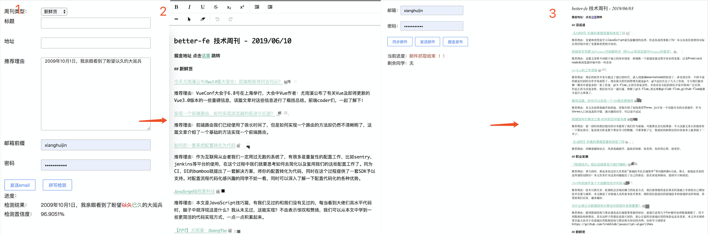

## betterfe 前端周刊 - 自动搜集 - 发布

### Background

项目组内，每周会向同事征集一篇最近看过的好文章，并附带推荐理由和推荐类别，统一整理并通过邮件和掘金发布，人工处理费时费力，且容易出错

### Feature

- 一键发布，省时省力
- 邮件和掘金发布的格式不同，该工具会自动转化，不必手动操作
- 引入百度大脑，智能纠错，避免一些低级的拼写错误
- 有时不同的同事会推荐同一篇文章，该工具会自动检测出来并给出提示

### Preview


ps: *127.0.0.1替换为自个配置内网域名*
### ⌨️ Development

```node
git clone https://github.com/mini-peanut/weekly-publish.git
cd weekly-publish
npm i && npm run dev
```

### Options

支持一些自定义选项

配置项名称 | 说明 | 默认值 |
---- | --- | --- |
filter | 抓取邮件时的针对**标题**的过滤项 | betterfe 
users | 收集周刊的人员列表，用于展示哪些同学还没发周刊 | []
imap | imap 配置 | {} |
smtp | smtp 配置 | {} |
sendTo | 收件邮箱 | '' |
sendCC | 抄送邮箱 | '' |

### Handlers

配置项名称 | 说明 | 参数 |
---- | --- | --- |
format | 对邮件内容进行格式化，提取有用信息 | function(headers, data)，headers为邮件头部，包括收件人, data表示邮件内容 |

### Step

1. 同事访问 127.0.0.1:8886/add-weekly 添加推荐周刊，支持拼写检测
2. 管理员通过访问 127.0.0.1:8886 收集其他同事的周刊并整理成一份，用于发布邮件和掘金
3. 可查看效果

### 🔗 Links

[掘金地址](https://juejin.im/user/5bfd30cd6fb9a049bb7c064d)
